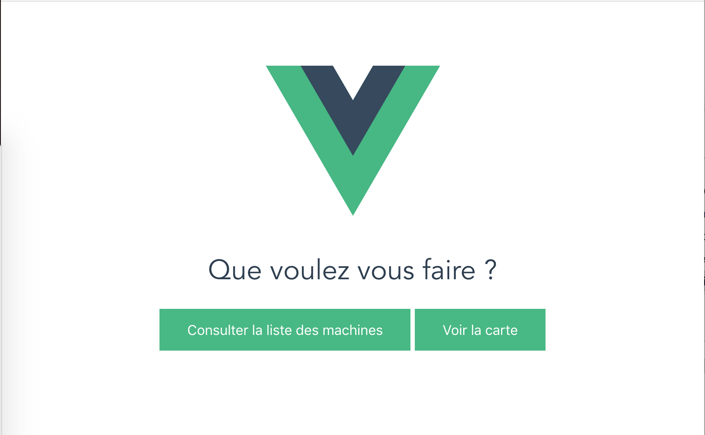
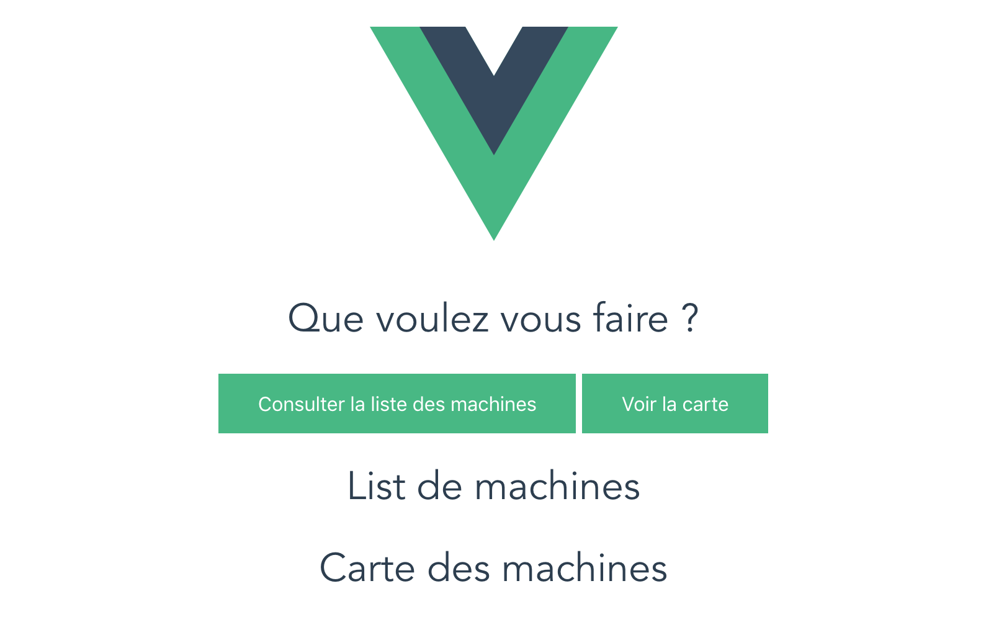
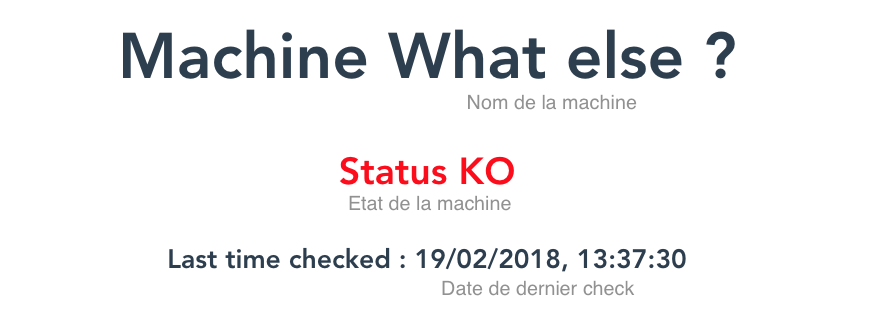
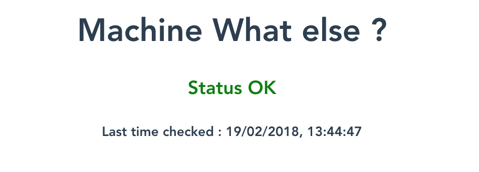
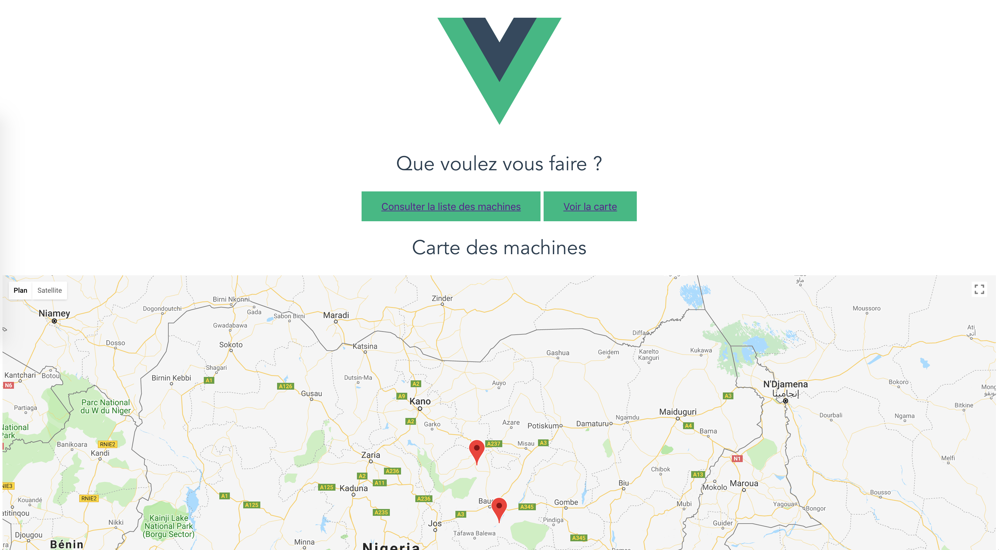

# Application de gestion du parc des machines à café.


### 1) Initialiser une application Vue.

* Commençons par créer une application VueJS, pour cela utilisons l'interface en ligne de commande officielle `vue-cli`.

Si ce n'est pas fait, il faut d'abord l'installer avec npm :

```
npm install --global vue-cli
```

**Question :** Rappeler ce qu'est npm et pourquoi nous utilisons l'option `--global` ?

**Votre réponse :**

* Créez maintenant l'application :

```
vue init browserify-simple [NOM_PROJET]
```

Si des questions vous sont posées, choisissez les options par défaut.

**Question :** Quels sont les bons réflexes à avoir quand vous téléchargez un nouveau projet ? Quels fichiers regarder en priorité ? 

**Votre réponse :**
  
Avant même de commencer à lancer l'application et sans regarder le code vous pouvez apprendre plein de choses. Prenez cette habitude.

**Question :** Si vous regardez le fichier `README.md` du projet vous voyez que trois commandes sont indiquées, quel est le but de chacune ?

**Votre réponse :**
 
* Lancez le projet.

**Question :** Une fois que tout fonctionne faites un premier commit ( vous aurez surement besoin d'initialiser le repository git ). Quelle est la commande à utiliser ? 🤔

**Votre réponse :**


### 2) Ecran d'accueil.

Dans un premier temps, nous voulons changer l'écran d'accueil, ce dernier permettra à l'agent de maintenance de choisir entre consulter la liste des machines ou afficher la carte.

Faites les modifications nécessaires, voici à titre d'exemple un rendu possible :



* Ajoutez dans votre composant App deux méthodes : `onMachinesListClick` et `onMapClick` qui devront faire des [alertes](https://developer.mozilla.org/fr/docs/Web/API/Window/alert) pour marquer le fait qu'un utilisateur a cliqué dessus.


### 3) Préparation des écrans.

Nous voulons préparer les écrans de la liste des machines ainsi que celui des cartes. En VueJs tout est composant, si nous voulons un nouvel écran, il nous fait un nouveau composant.

* Créez donc deux fichiers `MachinesList.vue` et `MachinesMap.vue`, les templates de ces composants seront très simples dans un premier temps, par exemple un simple titre h1 avec 'Liste des machines' ou 'Carte des machines' est suffisant.

* Faites en sorte d'ajouter ces deux composants Vue au template de votre app.

Votre page doit ressembler à ceci :



➡️**Commiter dans git avec un message explicite, par exemple 'fin étape 3' ou même "Ajout composants MachinesList et MachinesMap"**


### 4) Mise en place d'un routeur.

Le problème est que nous ne voulons pas avoir une seule page sur notre application. 
Nous devons avoir la possibilité de naviguer d'une page à l'autre, sans recharger la page ou sans afficher une nouvelle page html, nous avons besoin de mettre en place un routeur.

C'est la même chose que Laravel, sauf qu'ici le routeur est côté client, nous devons définir nos routes côté client et avoir moyen d'en changer.

Cela tombe bien, Vue a un routeur tout prêt que nous allons utiliser, [vue-router](https://router.vuejs.org/fr/)


##### 4.1) Installation.

Faites l'installation avec npm comme décrite dans la documentation. N'oublier pas d'ajouter après l'installation ces deux lignes :

```
import VueRouter from 'vue-router'

Vue.use(VueRouter)
```

**Question :** quelle est la différence entre `npm install vue-router` et `npm install --save vue-router` ? Laquelle est à privilégier ici ?

**Votre réponse :**

##### 4.2) Configuration.

Nous voulons déclarer deux routes, une `/machines` avec la liste des machines et une `/map` qui contiendra la carte.

* Déclarez votre tableau de route dans le fichier `main.js` en faisant référence aux composants créés avant.

* Initialisez l'objet router de Vue contenant ces routes et injectez-le dans la création de l'app Vue, votre code doit ressembler à :

```
new Vue({
  el: '#app',
  router,
  template: '<App/>',
  components: { App }
})
```

* Supprimez maintenant les composants `MachinesList` et `MachinesMap` du template de notre composant `App.vue`.

Vous devriez retomber sur un écran correspondant à l'étape 1 plus haut. 

Nous avons initialisé notre composant mais nous ne l'avons pas utilisé.

##### 4.3) Utilisation.

Pour l'utiliser nous devons utiliser les deux composants fournis par VueRouter :

* `<router-view></router-view>` qui spécifie à quel endroit de votre page le contenu de la route correspondant au composant spécifié dans la déclaration va être inséré.
* `<router-link to="" ></router-link>` qui permet de passer d'une page à l'autre.

Ajoutez donc `<router-view></router-view>` à la fin du template de notre composant `App.vue` et utilisez `<router-link to="NOM_ROUTE" ></router-link>` pour passer d'une page à l'autre dans le même composant.

Voici le résultat que vous devriez obtenir : [GIF](http://recordit.co/6kVde9Yu7S)


### 5) Création d'un composant pour représenter une machine.

##### 5.1) Composant statique dans une nouvelle route.

Créez dans un premier temps une nouvelle route `'/machine'` qui va représenter un nouveau composant à créer `Machine.vue`.

Ce composant aura comme `data` l'objet javascript suivant :

```
{
    name: 'What else ?',
    status: false,
    checkedAt: new Date(),
}
```

et aura comme rendu quelque chose ressemblant à :



Si vous changez `status` en `true` alors :



Notes : 
* Pour afficher la date, la méthode [toLocaleString()](https://developer.mozilla.org/fr/docs/Web/JavaScript/Reference/Objets_globaux/Date/toLocaleString) de Date devrait vous aider.
* Ici un simple titre h1 est utilisé pour le nom, un h3 pour le status et un h5 pour la date, vous pouvez bien évidemment l'adapter en fonction de vos envies.
* On a déclaré une route mais pas donné de lien explicite dans l'application pour y accéder, mais vous pouvez directement [changer l'url du navigateur](http://localhost:8080/#/machine).

➡️**Faites un commit avec un message explicite**

##### 5.2) Passage de props au composant Machine.

Nous avançons bien ! Notre dernier composant va nous aider à construire l'écran comprenant la liste de nos machines. Mais aujourd'hui il a une limite : on ne peut pas modifier le nom, le status de la machine sans toucher au code, il faut trouver un moyen de paramétrer notre composant. Pour cela nous allons utiliser la notion de props dans VueJS.

Pensez aux props comme aux paramètres d'une fonction. 

Pour rendre paramétrable une fonction il faut ajouter des paramètres. Pour rendre paramétrable un composant il faut ajouter des props.

* Dans un premier temps, appelez le composant `Machine` dans le composant `MachinesList`. Vous devriez donc avoir la même page aux urls `/machines` et `/machine`.

* Ajoutez le fait que le composant `Machine` a trois props qui s'appellent `name`, `status` et `checkedAt`, supprimez les datas du composant `Machine`, mais ajoutez les dans le composant `MachinesList`.

* Modifiez le composant `MachinesList` pour passer les props `name`, `status` et `checkedAt`.

À ce stade, vous devriez avoir la même chose qu'avant en terme de rendu, néanmoins nous sommes prêts à faire notre liste de machines car nous avons un composant `Machine` qui est paramétrable grâce aux props !

➡️**Faites un commit avec un message explicite**

### 6) Création d'une liste.

Modifiez le composant `MachinesList` pour que ces datas retournent l'objet suivant :

```js
{
    machines: [{
        id: 1,
        name: 'What else ?',
        status: true,
        checkedAt: new Date(),
    }, {
        id: 2,
        name: 'Broken',
        status: false,
        checkedAt: new Date(),
    }]
}
```

**Question :** Remarquez que nous avons ajouté une clef `id` à nos objets, pourquoi ?

**Votre réponse :**

* Modifiez un peu le style pour que les éléments de la liste soient mieux visibles, voici un exemple de ce que vous pourriez obtenir :


➡️**Faites un commit avec un message explicite**


### 7) Création d'une map.

Nous voulons maintenant arriver à visualiser les différentes machines sur une carte.

##### 7.1) Choisir le bon package.

Pour afficher une carte nous allons utiliser la librairie de google-maps avec un package spécialement créé pour Vue.

Ce package est disponible à [cette adresse](https://github.com/xkjyeah/vue-google-maps).

Il est toujours fondamental de savoir évaluer avant de se lancer un package ou un projet sur github ou même npm.

**Question :** Prenez le temps de regarder la page, qu'est ce qui vous inspire confiance ? Ou au contraire méfiance ?

**Votre réponse :**

##### 7.2) Map vide.

Pour pouvoir utiliser ce plugin, nous avons besoin de créer une clef API, pour faire cela suivre [les instructions](https://developers.google.com/maps/documentation/javascript/get-api-key).

Le concept de clef API est très, très commun, aussi nous vous invitons à prendre quelques minutes pour le comprendre.

**Question :** A quoi sert une clef API ? Puis je partager cette clef ? Dois je la commiter ?

**Votre réponse :**

Une fois que vous avez votre clef, insérez ce bout de code dans votre fichier `main.js` :

```
import * as VueGoogleMaps from 'vue2-google-maps'
Vue.use(VueGoogleMaps, {
  load: {
    key: 'YOUR_API_TOKEN',
  }
})
```

Puis dans votre composant `MachineMap` ajoutez ce code :

```
<gmap-map
  :center="{lat:10, lng:10}"
  :zoom="7"
  style="width: 100%; height: 800px"
>
</gmap-map>
``` 

Prenez le temps de jouer sur les paramètres pour les comprendre.

➡️**Faites un commit avec un message explicite**

##### 7.3) Ajouter les marqueurs.

Dans un premier temps consultez la liste d'exemples du projet et trouvez un moyen d'ajouter des marqueurs sur la carte.

Maintenant ajoutez une propriété `machines` au data du composant qui a la forme suivante :

```js
machines: [{
  id: 1,
  latitude: 10,
  longitude: 10,
},
{
  id: 2,
  latitude: 11,
  longitude: 9.6,
}]
```

En utilisant un `v-for`, affichez des marqueurs aux deux positions des machines spécifiées.

Voici un exemple de rendu : 


➡️**Faites un commit avec un message explicite**


### 8) Récupérer les données via une API externe.

Nous avons créé pour vous une API REST permettant de gérer le parc de vos machines. Cette api est disponible à cette url : [https://machine-api-campus.herokuapp.com/api](https://machine-api-campus.herokuapp.com/api). Et la documentation [ici](https://machine-api-campus.herokuapp.com/).

Il est important de comprendre les principaux verbes d'une API HTTP et de savoir lire une documentation pour connaitre ses possibilités et ses limitations, prenez quelques minutes pour bien comprendre la documentation de cette API.

L'API contient notamment la liste des machines que nous allons récupérer pour adapter nos vues de liste et de carte.

⚠️**Ne passez pas à côté de cette partie, les notions mises en jeu sont fondamentales.**

##### 8.1) Installation d'une librairie permettant de faire des appels HTTP.

Pour pouvoir faire des appels à une API, VueJS préconise l'utilisation de la librairie [axios](https://github.com/axios/axios).

Prenez toujours le temps d'analyser cette librairie sur github, qu'est ce qui vous inspire confiance ? Ayez le réflexe de chercher la librairie sur [npm](https://www.npmjs.com/package/axios) pour notamment voir le nombre de téléchargements.

* Installez la librairie avec npm.

➡️**Faites un commit avec un message explicite**

##### 8.2) Notion de promesses.

* La notion de promesses est fondamentale en javascript, prenez le temps de lire en détail la [documentation](https://developer.mozilla.org/fr/docs/Web/JavaScript/Guide/Utiliser_les_promesses).

* Réalisez ensuite le cours 12 du cours de CodeAcademy sur les [requêtes](https://www.codecademy.com/fr/learn/introduction-to-javascript).

☝️**Prenez le temps de solliciter les formateurs pour faire le point sur ce que vous avez compris :**

* Quel problème cherchons nous à résoudre ?
* Quelle est la solution proposée ?
* Comment la mettre en oeuvre ?

##### 8.3) Utilisation dans le projet.

Nous allons afficher la liste des machines provenant de cette [route](https://machine-api-campus.herokuapp.com/api/machines).

Comme vous le savez une promesse a plusieurs états :

* En cours.
* Terminée et succès.
* Terminée et erreur.

Nous devons suivre ces états dans notre composant, ajoutez donc aux datas deux clefs `loading` et `error` permettant de savoir si la requête est en cours et si il y a eu une erreur.

Aussi, enlevez les machines que nous avions mises tout à l'heure.

Votre data devrait ressembler à ça :

```js
data: function() {
    return {
      machines: [], // au début la liste des machines est vide
      loading: false,
      error: null,
    }
}
```

Avant d'aller plus loin, il faut choisir quand lancer la requête, la solution communément admise est de dire : "Quand le composant est créé, lance la requête".

Vuejs nous permet de déclencher des actions ( ou *hooks* ) à certains moments précis de la vie d'un composant. La liste est disponible [ici](https://fr.vuejs.org/v2/api/index.html#Options-Cycle-de-vie-des-hooks). Celui qui nous intéresse est le `created`.

* Ajoutez donc l'appel http avec axios permettant d'afficher la liste des machines.

* Faites en sorte d'afficher un texte `requête en cours` si jamais la requête est en cours et une erreur en rouge si jamais la requête produit une erreur.

➡️**Faites un commit avec un message explicite**

##### 8.4) Mise à jour du composant MachinesMap.

Faites la même chose pour le composant `MachinesMap` afin qu'il affiche tous les marqueurs des machines de l'API.

##### 8.5) Eviter le doublon.

Si vous faites attention, nous faisons le même appel http dans nos deux composants, ça fonctionne mais ce n'est pas optimal : l'utilisateur va attendre deux fois pour consulter les mêmes données.

* Quelles idées avez vous pour répondre à ce problème ?

Discutons-en et essayez de mettre en oeuvre une solution.

### 9) Aller plus loin.

##### 9.1) Centrer la carte par rapport à sa localisation.

Pour rendre plus pratique son utilisation, faites en sorte que la carte soit centrée par rapport à la position de l'utilisateur utilisant la carte.

Documentation de l'API du navigateur pour la [géolocalisation](https://developer.mozilla.org/fr/docs/Web/API/Navigator)


##### 9.2) Filtrer la liste des machines.

Nous voulons permettre à l'utilisateur de visualiser uniquement les machines qui ont le même `status`.

* Ajoutez un select avec trois entrées ( "ok", "ko", "*" ) permettant de filtrer uniquement les machines en fonction du status.


##### 9.3) Ajouter une nouvelle machine.

Faites un formulaire qui permet d'ajouter une nouvelle machine et utilisez l'API pour l'ajouter en base de données.


##### 9.4) Modifier ou supprimer une machine existante.

Faites la même chose pour une modification ou suppression de machine. ( Attention à ne pas tout supprimer, vous travaillez tous sur la même base de données ).


### 10) Packager l'application dans cordova.

En utilisant le template fourni en début de module, packagez votre application avec cordova et faites-la tourner sur un émulateur android.


### 11) Aller ( encore ) plus loin.

Laravel et Vue ayant une très bonne intégration, refaites l'API avec LARAVEL.

Vous pouvez y ajouter un système d'authentification qui ne permettrait de voir les machines que si vous êtes connecté, et qui n'autoriserait la création/modification/suppression que si l'utilisateur a un rôle d'admin [DOC](https://laravel.com/docs/5.6/passport)
